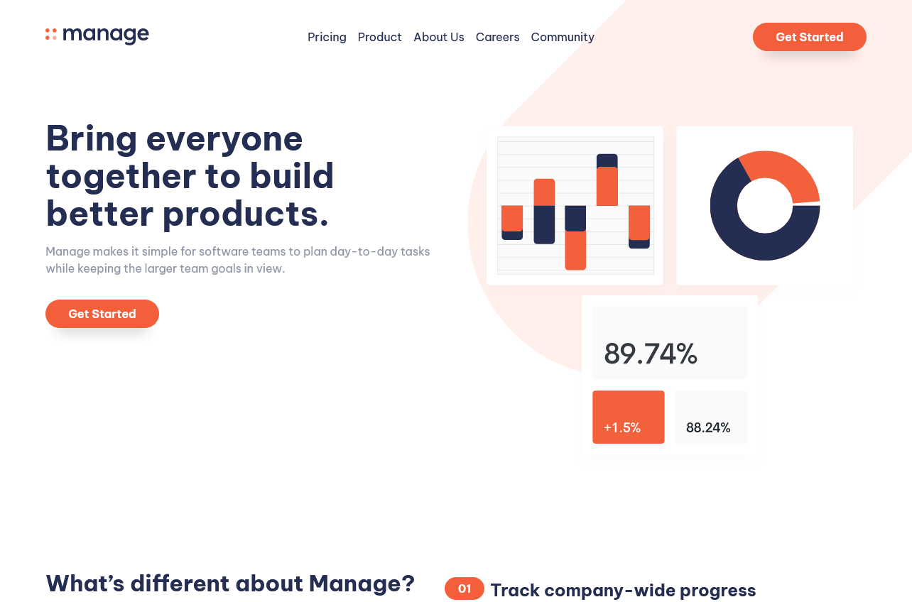

# Frontend Mentor - Manage landing page solution

This is a solution to the [Manage landing page challenge on Frontend Mentor](https://www.frontendmentor.io/challenges/manage-landing-page-SLXqC6P5). Frontend Mentor challenges help you improve your coding skills by building realistic projects.

## Table of contents

- [Overview](#overview)
  - [The challenge](#the-challenge)
  - [Screenshot](#screenshot)
  - [Links](#links)
- [My process](#my-process)
  - [Built with](#built-with)
  - [What I learned](#what-i-learned)
  - [Continued development](#continued-development)
  - [Useful resources](#useful-resources)
- [Author](#author)

## Overview

### The challenge

Users should be able to:

- View the optimal layout for the site depending on their device's screen size
- See hover states for all interactive elements on the page
- See all testimonials in a horizontal slider
- Receive an error message when the newsletter sign up `form` is submitted if:
  - The `input` field is empty
  - The email address is not formatted correctly

### Screenshot

### Links

- [Live Site URL](https://fem-challenge-manage-landing-page.netlify.app/)

## My process

### Built with

- Semantic HTML5 markup
- CSS3
- Flexbox
- Javascript
- [A11y Slider](https://a11yslider.js.org/)

### What I learned

My favourite parts of this challenge was creating the responsive menu, and the javascript horizontal slider. The menu was created and coded 100% by me. For the slider I used a javacript library referenced above. It was my first time using a JS library ad it was very good learning.

### Continued development

I feel like my biggest challenge was placing the SVG images in the background. I managed to do t, but it looks different from the original design files. I am going to keep trying to work with SVGs in order to perfect these techniques.

### Useful resources

- [Kevin Powell](https://www.youtube.com/playlist?list=PL4-IK0AVhVjNDRHoXGort7sDWcna8cGPA) - My solution is 100% different from Kevin's, but his playlist on youtube solving this exact challenge was very insightful.

## Author

- Website - [Joana Parente](https://joanaramosparente.pt/)
- Frontend Mentor - [@jrparente](https://www.frontendmentor.io/profile/jrparente)
